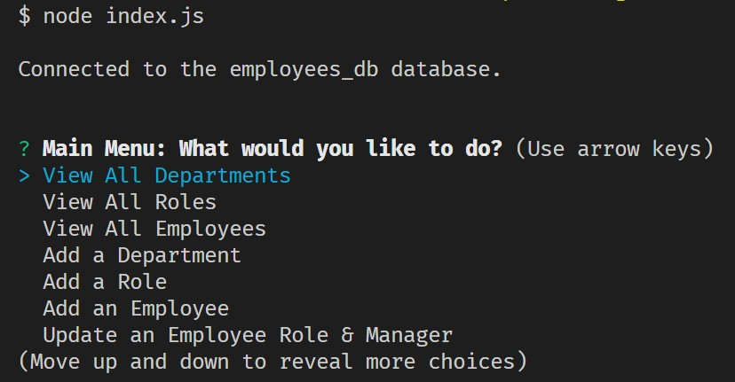
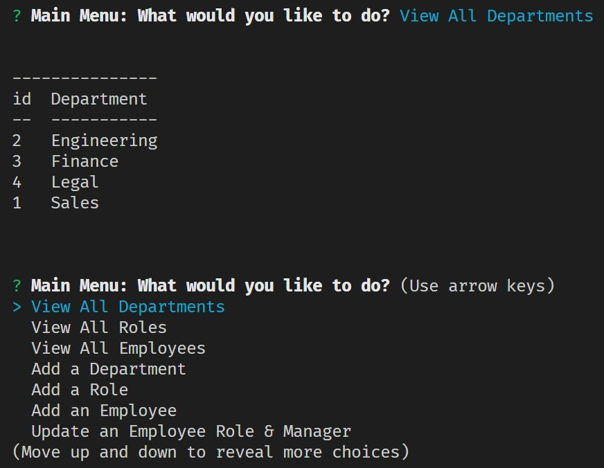
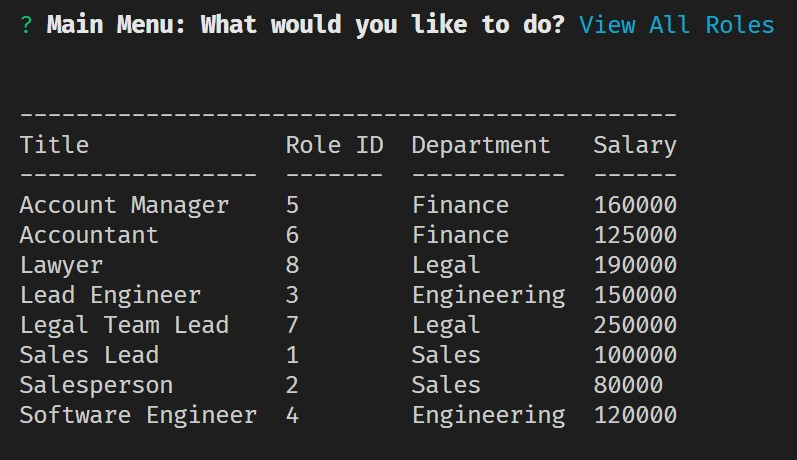
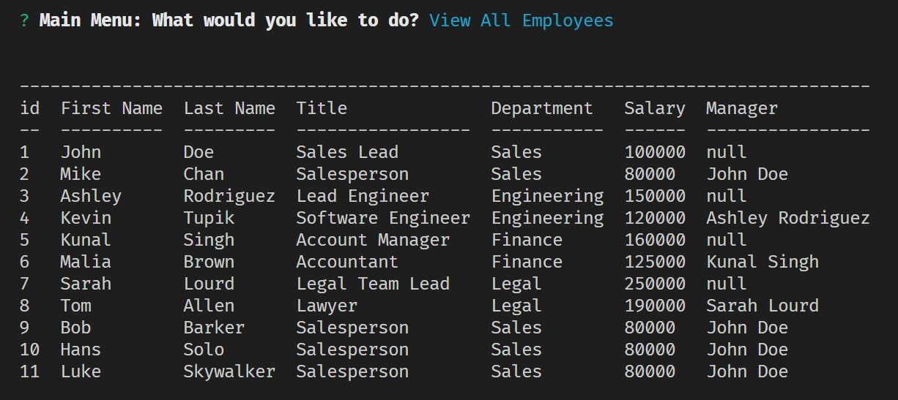

# c12-SQL-employee-tracker
This is challenge 12 for the UT Coding Bootcamp: SQL Employee Tracker.

## Description

> Provide a short description explaining the what, why, and how of your project. Use the following questions as a guide:  
>   
> - What was your motivation?  
> - Why did you build this project? (Note: the answer is not "Because it was a homework assignment.")  
> - What problem does it solve?  
> - What did you learn?  

## Table of Contents

- [Installation](#installation)
- [Usage](#usage)
- [Credits](#credits)
- [Collaborators](#collaborators)
- [License](#license)

## Installation

> What are the steps required to install your project? Provide a step-by-step description of how to get the development environment running.

## Usage

[Walk Through Video](https://drive.google.com/file/d/1qfSAwMQpdRBDVqeCqYanAOj8tYZaJbCy/view?usp=sharing)

Main Menu - Use arrow keys to select options: 

 

Selecting `View All Departments` will display all departments, then return you to Main Menu: 

 

 

 

You will be prompted to either make a SELECTION or ENTER input when required:

## Credits

Full-Stack Blog - [Professional README Guide](https://coding-boot-camp.github.io/full-stack/github/professional-readme-guide)

Udemy Blog - [SQL Self Join: A Simple Way to JOIN Data in SQL](https://blog.udemy.com/sql-self-join/)

Rebecca Girndt - https://github.com/Re-Gi - _demystifying async await_

## Collaborators 

|   Study   |      Group     | Partners |
|:----------------:|:--------------:|:-----------------:|
| [Harrison Boatman](https://github.com/harrisonboatman) | [Josh Goeke](https://github.com/joshuagoeke)     | [Nick McCarthy](https://github.com/Nick-McCarthy)     |
| [Erin Peifer](https://github.com/Airen22)      | [Stephen Totten](https://github.com/Crothos) | [Magdalene Zernick](https://github.com/MZernick) |

## License

Please see LICENSE file.

---